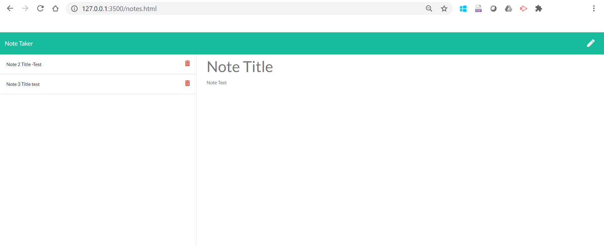

  # Interactive Note Taker Project   
  
   
  
  ## Table of Contents
  
  - [Description](#description)
  - [Installation](#installation)
  - [Usage](#usage)
  - [License](#license)
  - [Contribution](#contribution)
  - [Test](#test)
  - [Authors](#authors)
  - [Questions](#questions)
  
   
  
  ## Description  
  
  This project helps a user take notes on the browser and save the contents of the notes to an array object that form part of the project files - db.json. This project employes express, node, javascript and normal css/html to deliver its functionality. Request routing is achieved using express with default routing to the landing page. API calls for POST and DELETE to the JSON database is achieved using AJAX. Asynchornous readFile and writeFile methods are also utilized. The pages and core functionality is served by Node JS on port 3500. 
  
  ## Installation
  
  Clone the code to your github repository and use 'npm install' command in the terminal to install dependencies. Run the program using: 'node app.js'
  
  ## Usage
  
Please clone the project to your local repo, install the dependencies, start the node server and launch your browser on port 3500. Enter your node title and body text and click the save button to save the data permanently on the JSON database. To delete an entry, please click on the 'delete' icon and refresh page and the deleted entry will be removed from the page.   Please see the deployed page here: https://note-takr.herokuapp.com/. 

 
 
 
 
 
  
  ## License
  
  This project is licensed under:
  
   
  
  MIT
  
  ## Contribution
  
  Please contact me on my email [Email Address](anyaegbufrancis@gmail.com) or fork the repository from my github account: [Github Profile](https://github.com/anyaegbufrancis). Please make a pull request and we can review the updates, corrections or bug fixes together.
  
  ## Test
  
  Please click the image below to see the feature demo on the linked video:
  
  
  
  ## Authors
  
  The author of this project is: 
  
  Francis Anyaegbu. 
  
  To contribute, please refer to [Contributors](#contributors) section.
  
  ## Questions
  
  For questions, concerns, comments or your valued inputs regargind this README.md generator, kindly go to my Github page or contact me on my email address below:
    
  - [Github Profile](https://github.com/anyaegbufrancis)
                    
  - [Email Address](anyaegbufrancis@gmail.com)
